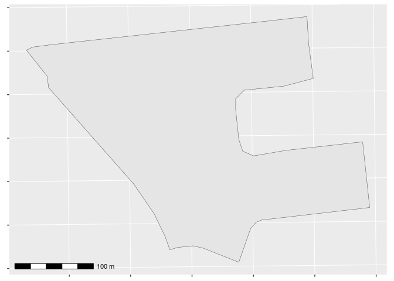
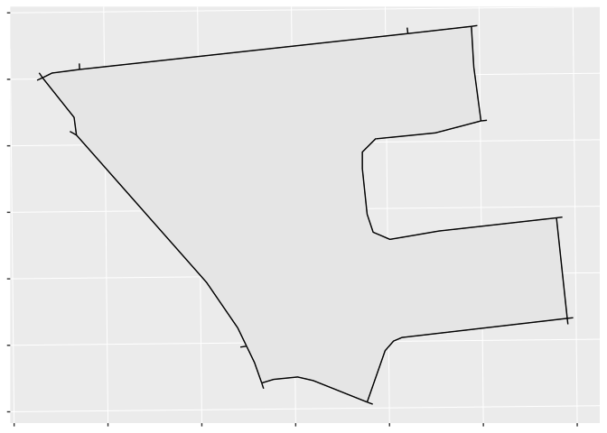
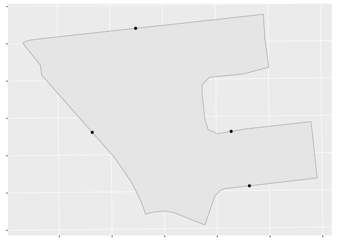
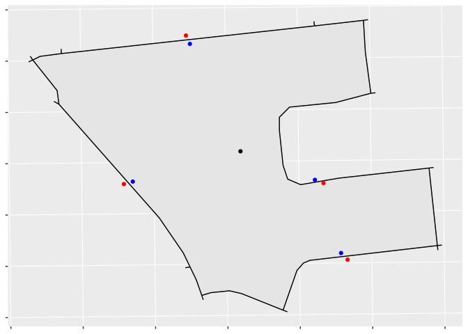
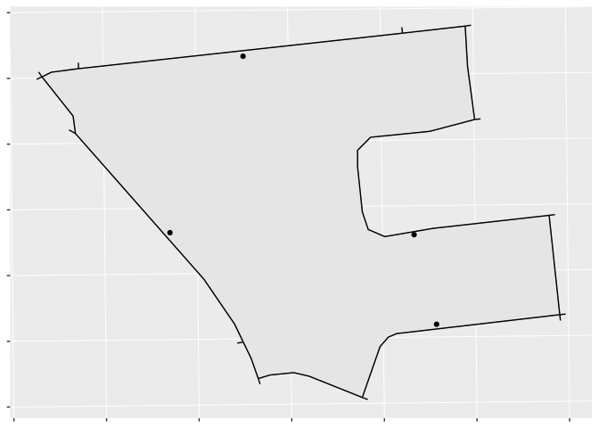

# Summary

Researchers and policymakers often wish to estimate a population's travel burden when accessing services like healthcare or outdoor recreation. However, while services are usually located at discrete points, population counts are generally given for polgyonal areas like city blocks, neighbourhoods, or census tracts. Since travel burdens are generally calculated from points to points, there is a need to translate polygons to points for analysis.

Pseudohouseholds (PHHs) are representative points placed along road segments and inside regions that provide spatial distributions of properties that are defined over regions (in practice, usually population). They provide an approximate way of "spreading out" regional population distributions that can be helpful when doing travel analyses. We say that PHHs are "pseudo" households because they do not represent actual buildings or households, but they approximate the distribution of households by creating a set of populated points where we think the households are likely to be. This can allow us to create finer-grained travel or coverage analyses.

# Statement of Need

`Pseudohouseholds` is an R package for generating representative points along road networks within regions--"pseudohouseholds," or "PHHs"--that can be used for population-weighted travel analyses. Users supply arbitrary input sets of polygons (for regions) and polylines (for road networks), and have fine-grained control over their final distribution through a number of parameters. The package contains functions for creating pseudohouseholds and validating that a set of pseudohouseholds is valid, and include sample polygons and road networks for testing the functions. It supports parallel processing, and is available to install from CRAN [@belanger_pseudohouseholds_2023].

# Description of the Algorithm

We demonstrate by showing how the algorithm assigns PHHs to the single census dissemination block (DB) in Ottawa, Ontario, with unique identifier "35061699003." This DB has an irregular shape, is several hundred meters across, and is bordered on all sides by roads (see Figure \ref{figA}).

* **Step 0: Determine if the region is populated.** If the region is unpopulated, by default we return one point with population 0 that is flagged as uninhabited.
* **Step 1: Find road segments intersecting or near the region.** Next we find road segments that either intersect the region plus a user-specified buffer, which in this case is set to the default of 5 meters (Figure \ref{figB}).

* **Step 2: Create initial points by sampling along the road segments.** Next we sample points along these road segments, with a default sampling rate of one point every 200 meters (Figure \ref{figC}).

* **Step 3: Create candidate PHHs beside the road network.** Next we generate candidate PHHs by perturbing our initial points, using a fast and simple “push/pull” approach that creates two candidate PHHs from each point by “pushing” and “pulling” it a set distance towards and away from the centroid. In our example (Figure \ref{figD}), most but not all of the blue “pull” candidates are within the DB.

* **Step 4: Keep only candidate PHHs within the region.** Finally, we apply a spatial figure to remove all points outside of the region, giving us a set of PHHs within the region (Figure \ref{figE}).

* **Step 4a: Fallback if no valid points are returned in Step 4.** A backup algorithm samples radially around our on-street points and selects the first viable candidate. If still no valid PHHs are found, the function returns a single default point and flags it for user follow-up.

* **Step 5 (optional): Ensure our PHHs have a minimum population.** We can optionally prune PHHs to ensure they have a minimum population, which helps to distribute PHHs in large rural areas that would otherwise have many PHHs with populations less than 1.

* **Step 6 (optional): Ensure that PHHs are separated by a minimum distance.** We can optionally remove PHHs within a minimum distance of each other, which can happen in some cases due to artefacts of the input road network.

* **Step 7 (optional): Distribute regional population among PHHs.** If we are assigning population counts, each PHH receives an equal share of the region's population.

The result is a set of points that are within the region, near a road, not too close together, and each have an equal share of the region’s population.

# Comparison to Other Methods

We are unaware of any published prior software for producing pseudohouseholds, making this software a unique contribution. This algorithm was inspired by prior work by the Government of Canada, which has produced "Pseudo-Household Demographic Distributions" for Canada in census years 2016 and 2021, although their methods are not published and we were unable to obtain details upon request [@government_of_canada_pseudo-household_2023]. 

There are other methods of converting polygons to points for travel analysis. One common method assigns a region's entire population to a single point, usually the centroid. This assumption can be problematic in regions which are larger, are more rural, or that are concave and do not contain their centroids.

# Links to Research

The R package `pseudohouseholds` has been used in unpublished applied research with the Ottawa Neighbourhood Study investigating spatial proximity and access to public services including libraries, and further academic research is underway to validate its use for further analyses in other settings. 

# Figures

# References

